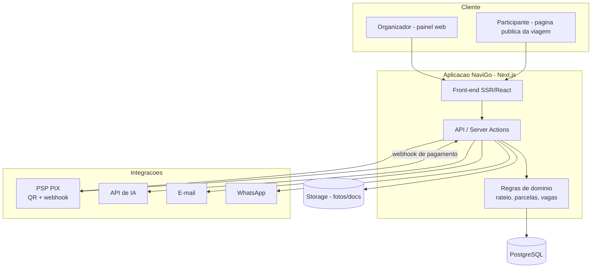

# 🏛️ Arquitetura — NaviGo

> **Status:** proposta inicial para a Fase 0. Tudo aqui é ponto de partida e
> pode ser ajustado antes da primeira linha de código.

---

## 1. Princípios

- **Simplicidade primeiro.** Um monólito full-stack bem organizado entrega o MVP
  mais rápido que microsserviços.
- **Mobile-first.** A maioria dos participantes acessa pelo celular.
- **Integrações desacopladas.** PSP de PIX, IA e notificações ficam atrás de
  interfaces próprias, para trocar de fornecedor sem reescrever regras.
- **Privacidade por padrão (LGPD).** Coleta mínima e consentimento explícito.

---

## 2. Stack recomendada

| Camada | Recomendação | Alternativas | Por quê |
|--------|--------------|--------------|---------|
| Full-stack | **Next.js (App Router) + TypeScript** | Remix, Nuxt | Front + back num só projeto; SSR para páginas públicas de viagem |
| UI | **Tailwind CSS + shadcn/ui** | Chakra, MUI | Rápido, acessível, consistente |
| Banco | **PostgreSQL + Prisma** | Drizzle | Relacional combina com o domínio; Prisma acelera |
| Auth | **Supabase Auth** | Auth.js (NextAuth), Clerk | Social + magic link prontos |
| Storage | **Supabase Storage** | AWS S3, Cloudflare R2 | Fotos, documentos, comprovantes |
| Pagamentos PIX | **PSP brasileiro** (Mercado Pago / Asaas / Pagar.me) | Stripe (PIX) | QR Code dinâmico + webhook de confirmação |
| IA | **API de LLM** (Anthropic Claude / OpenAI) | — | Assistente operacional |
| E-mail | **Resend** | Postmark, SES | Transacional simples |
| WhatsApp | **API oficial** (Cloud API / provedor) | Twilio | Notificação onde o público já está |
| Filas/jobs | **Cron + fila** (Vercel Cron / QStash / Inngest) | BullMQ | Lembretes e conciliação |
| Deploy | **Vercel** + banco gerenciado (Supabase/Neon/Railway) | Fly.io, Render | Previews por PR |
| Observabilidade | **Sentry** + analytics de produto | Logtail | Erros e uso |

> **Decisão sobre Supabase:** adotá-lo dá Auth + Postgres + Storage de uma vez,
> acelerando o MVP. Se preferir menos acoplamento, use Auth.js + Postgres
> gerenciado + S3 — mantendo o mesmo modelo de dados.

---

## 3. Visão de arquitetura



---

## 4. Componentes principais

- **Páginas públicas de viagem** — renderizadas no servidor (SSR) para
  carregamento rápido e compartilhamento por link/QR.
- **Painel do organizador** — área autenticada com viagens, pagamentos e tarefas.
- **Módulo de regras de domínio** — cálculo de rateio, margem de segurança,
  geração de parcelas e controle de vagas. Deve ser **testado com testes
  unitários** (é o coração financeiro).
- **Camada de integração** — adaptadores para PSP, IA e notificações, cada um
  atrás de uma interface (`PaymentProvider`, `AiAssistant`, `Notifier`).

---

## 5. Integrações-chave

### 5.1 Pagamentos PIX
1. Organizador cadastra a chave/credenciais PIX (ou conecta a conta no PSP).
2. Para cada parcela, o sistema gera um **QR Code PIX dinâmico** via PSP.
3. O PSP notifica o pagamento por **webhook** → o sistema dá **baixa automática**.
4. Jobs agendados enviam **lembretes** de vencimento e marcam inadimplência.

> **MVP:** PIX **direto ao organizador** (sem custódia) reduz risco regulatório
> e de confiança. Intermediação/split fica para o futuro.

### 5.2 Assistente de IA
- Entrada: respostas do organizador às perguntas guiadas.
- Saída: estrutura da viagem, checklist e sugestões de orçamento.
- **Guardrails:** validar/normalizar a saída da IA, limitar tokens/custo, ter
  fallback quando a API falhar. A IA **sugere**; o organizador **confirma**.

### 5.3 Notificações
- E-mail transacional para confirmações e lembretes.
- WhatsApp (API oficial) para o canal preferido do público.

---

## 6. Segurança e LGPD

- Autenticação forte, hashing de senha, rate limiting e validação de entrada.
- **HTTPS** em tudo; segredos apenas em variáveis de ambiente (nunca no código).
- **LGPD:** base legal e consentimento explícito; coleta mínima; política de
  privacidade; exportação e **exclusão de dados** a pedido; cuidado redobrado
  com **dados de menores** (autorização dos responsáveis).
- Webhooks de pagamento **validados por assinatura** e idempotentes.
- Trilha de auditoria para eventos financeiros.

---

## 7. Ambientes

| Ambiente | Uso |
|----------|-----|
| **Local** | Desenvolvimento; PSP e IA em sandbox |
| **Preview** | Um por PR (Vercel) para revisão |
| **Produção** | Público; segredos e banco isolados |

---

## 8. Estrutura de pastas sugerida

```
navigo/
├── app/                # Rotas Next.js (App Router)
│   ├── (public)/       # Paginas publicas de viagem
│   ├── (dashboard)/    # Painel do organizador (autenticado)
│   └── api/            # Rotas de API e webhooks
├── components/         # Componentes de UI (shadcn/ui)
├── lib/
│   ├── domain/         # Regras de negocio (rateio, parcelas, vagas)
│   ├── payments/       # Adaptador do PSP (PaymentProvider)
│   ├── ai/             # Adaptador de IA (AiAssistant)
│   └── notifications/  # Adaptador de notificacoes (Notifier)
├── prisma/             # schema.prisma + migracoes + seed
├── docs/               # Esta documentacao
└── tests/              # Unitarios (dominio) e e2e (Playwright)
```

---

## 9. Decisões em aberto (ADRs a registrar)

- [ ] PSP de PIX definitivo (Mercado Pago vs. Asaas vs. Pagar.me).
- [ ] Supabase (tudo-em-um) vs. Auth.js + Postgres + S3.
- [ ] Provedor de IA e política de custo.
- [ ] Estratégia de multi-tenant para o Business (schema por org vs. `org_id`).
- [ ] Ferramenta de jobs agendados (Cron/QStash/Inngest).

> Registre cada decisão como um ADR curto em `docs/adr/NNNN-titulo.md`.
