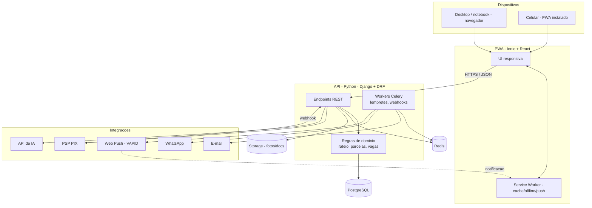

# 🏛️ Arquitetura — NaviGo

> **Status:** proposta para a Fase 0. Ponto de partida, ajustável antes da
> primeira linha de código.

O NaviGo é entregue como **um único web app (PWA)** que roda no navegador em
desktop/notebook **e** instala no celular como aplicativo (ícone na tela,
tela cheia, notificações push, câmera para QR). O frontend é uma PWA em
**Ionic + React**; o backend é uma **API em Python (Django + DRF)**. Tudo num
**monorepo**, e preparado para virar app nativo nas lojas via **Capacitor** no
futuro — sem reescrever a base.

---

## 1. Princípios

- **Uma base, todos os dispositivos.** PWA responsiva cobre web e mobile.
- **Mobile-first.** A maioria dos participantes acessa pelo celular.
- **API desacoplada.** Frontend e backend conversam por HTTPS/JSON; isso
  habilita o caminho para app nativo (Capacitor) depois.
- **Integrações desacopladas.** PSP de PIX, IA e notificações atrás de
  interfaces próprias, para trocar de fornecedor sem reescrever regras.
- **Privacidade por padrão (LGPD).** Coleta mínima e consentimento explícito.

---

## 2. Stack recomendada

| Camada | Recomendação | Alternativas | Por quê |
|--------|--------------|--------------|---------|
| Frontend (PWA) | **Ionic + React + TypeScript** (Vite) | React puro + Vite; Vue/Nuxt | Componentes com cara nativa no mobile; roda no desktop; instalável; pronto p/ Capacitor |
| PWA / offline | **vite-plugin-pwa** (Workbox) | next-pwa | Service worker, cache e instalação |
| Push | **Web Push (VAPID)** + `pywebpush` | Firebase Cloud Messaging | Push no PWA (Android e iOS 16.4+) |
| Backend / API | **Django + DRF** | FastAPI + SQLAlchemy | Admin, auth, ORM e migrations prontos |
| Auth | **dj-rest-auth + django-allauth** | SimpleJWT, Clerk | Social + tokens/sessão para a PWA |
| Banco | **PostgreSQL** | — | Relacional combina com o domínio |
| Jobs | **Celery + Redis** | Dramatiq, APScheduler | Lembretes e processamento de webhooks |
| Pagamentos PIX | **PSP brasileiro** (Mercado Pago / Asaas / Pagar.me) | Stripe (PIX) | QR Code dinâmico + webhook |
| IA | **SDK `anthropic` / `openai`** | — | Assistente operacional |
| E-mail | **Resend** | Postmark, SES | Transacional |
| WhatsApp | **API oficial** (Cloud API) | Twilio | Notificação onde o público está |
| Storage | **S3-compatível** (S3 / Cloudflare R2) | Supabase Storage | Fotos, documentos, comprovantes |
| Deploy | **Railway** — imagem única (PWA + API no mesmo domínio) | Serviços separados (API no Railway, PWA em CDN) | Um deploy só; sem CORS nem cookie entre origens |
| Observabilidade | **Sentry** (front+back) + analytics | — | Erros e uso |

> **Backend Django vs. FastAPI:** o **Django** rende MVP mais rápido pelo painel
> **admin** (ótimo para suporte/ops), auth e migrations prontos. Use **FastAPI**
> se preferir uma API async mais enxuta e não se importar em montar auth/admin.

---

## 3. Visão de arquitetura



---

## 4. A camada PWA (web + mobile)

O que torna o NaviGo um "app" no celular sendo um web app:

- **Instalável** — `manifest.webmanifest` + ícones + service worker permitem
  "adicionar à tela inicial", abrir em tela cheia e ter ícone próprio.
- **Offline** — o Workbox faz cache do *app shell* e das telas já visitadas;
  quando sem conexão, o app abre e mostra o essencial.
- **Push** — Web Push com chaves **VAPID**; no **iOS** funciona quando o PWA
  está **instalado** (Safari 16.4+). No Android funciona no navegador.
- **Câmera / QR** — para o check-in, `BarcodeDetector` no navegador; ao
  empacotar nativo, o plugin `@capacitor/barcode-scanner`.
- **Responsivo mobile-first** — os componentes Ionic já adaptam o visual a
  iOS/Android e funcionam bem no desktop.
- **Caminho nativo** — se um dia for preciso presença nas lojas, o **Capacitor**
  empacota **a mesma base** como app iOS/Android, com acesso a APIs nativas.

---

## 5. Integrações-chave

### 5.1 Pagamentos PIX
1. Organizador conecta a conta/credenciais no PSP.
2. Para cada parcela, a API gera um **QR Code PIX dinâmico** via PSP.
3. O PSP notifica por **webhook** → a API dá **baixa automática** (idempotente).
4. Tarefas agendadas (Celery) enviam **lembretes** e marcam inadimplência.

> **MVP:** PIX **direto ao organizador** (sem custódia) reduz risco regulatório
> e de confiança. Intermediação/split fica para o futuro.

### 5.2 Assistente de IA
- Entrada: respostas às perguntas guiadas. Saída: estrutura da viagem,
  checklist e sugestões de orçamento.
- **Guardrails:** validar/normalizar a saída, limitar tokens/custo e ter
  fallback. A IA **sugere**; o organizador **confirma**.

### 5.3 Notificações
- **E-mail** transacional (confirmações, lembretes).
- **Web Push** direto no PWA (o canal nativo do app instalado).
- **WhatsApp** (API oficial) para o canal preferido do público.

---

## 6. Segurança e LGPD

- Auth forte, hashing (nativo Django), rate limiting e validação de entrada.
- **CORS** restrito à origem do PWA; **CSRF** conforme o modelo de auth.
- Tokens no cliente com cuidado: preferir **cookie httpOnly** a `localStorage`
  para credenciais sensíveis.
- **HTTPS** em tudo; segredos só em variáveis de ambiente.
- Webhooks de pagamento **validados por assinatura** e **idempotentes**.
- **LGPD:** base legal e consentimento; coleta mínima; política de privacidade;
  exportação e **exclusão de dados**; cuidado redobrado com **dados de menores**.
- Assinaturas de **Web Push** são dado pessoal — guardar e permitir revogar.

---

## 7. Ambientes e deploy

| Ambiente | API | PWA |
|----------|-----|-----|
| **Local** | Django + Postgres + Redis (docker-compose); PSP/IA em sandbox | Vite dev server (porta 5173) |
| **Produção** | Um serviço no Railway: o Dockerfile da raiz compila o PWA e o Django o serve junto com a API, no mesmo domínio | — |

---

## 8. Estrutura de pastas sugerida (monorepo)

```
navigo/
├── api/                     # Backend Python (Django + DRF)
│   ├── navigo/              # settings, urls, asgi/wsgi
│   ├── apps/
│   │   ├── accounts/        # auth, perfil
│   │   ├── trips/           # viagens, config, orcamento
│   │   ├── participants/    # inscricoes
│   │   ├── payments/        # PIX, parcelas, webhooks
│   │   ├── notifications/   # e-mail, whatsapp, web push
│   │   └── ai/              # assistente
│   ├── manage.py
│   └── pyproject.toml
├── web/                     # Frontend PWA (Ionic + React + Vite)
│   ├── public/
│   │   ├── manifest.webmanifest
│   │   └── icons/
│   ├── src/
│   │   ├── pages/           # rotas (organizador + pagina publica)
│   │   ├── components/
│   │   └── lib/api/         # cliente da API
│   ├── capacitor.config.ts  # pronto p/ empacotar nativo no futuro
│   └── package.json
├── docs/                    # esta documentacao
└── docker-compose.yml       # postgres + redis para dev
```

---

## 9. Decisões em aberto (ADRs a registrar)

- [ ] PSP de PIX definitivo (Mercado Pago vs. Asaas vs. Pagar.me).
- [ ] Backend: **Django + DRF** vs. FastAPI.
- [ ] Frontend: **Ionic + React** vs. React puro.
- [ ] Estratégia de auth do PWA (cookie de sessão vs. JWT).
- [ ] Provedor de IA e política de custo.
- [ ] Quando (e se) empacotar nativo via Capacitor.
- [ ] Multi-tenant do Business (`org_id` vs. schema por org).

> Registre cada decisão como um ADR curto em `docs/adr/NNNN-titulo.md`.
