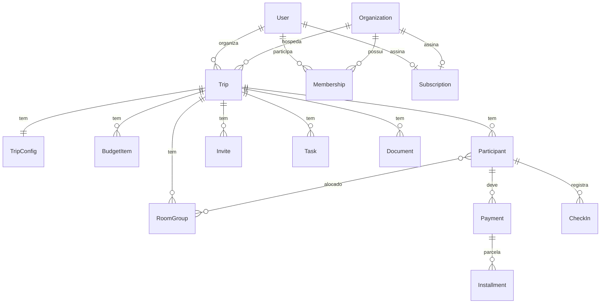

# 🗄️ Modelo de Dados — NaviGo

Modelo conceitual do domínio. Serve de base para o `schema.prisma`. Nomes de
entidades em inglês (padrão de código); rótulos em português para clareza.

> **Status:** proposta para a Fase 0. Ajuste antes de gerar as migrações.

---

## 1. Diagrama ER

---

## 2. Entidades

### User (Usuário)
Organizador e/ou participante autenticado.
- `id`, `name`, `email`, `phone`, `avatarUrl`
- `pixKey` (chave PIX do organizador — pode migrar para credenciais do PSP)
- `createdAt`, `updatedAt`

### Organization (Organização) — *Fase Business*
Igreja, escola ou empresa que agrupa vários organizadores.
- `id`, `name`, `type` (church | school | company | other)
- `createdAt`, `updatedAt`

### Membership (Vínculo) — *Fase Business*
Liga `User` ↔ `Organization` com papel.
- `id`, `userId`, `organizationId`
- `role` (owner | admin | organizer | finance | viewer)

### Trip (Viagem)
Entidade central.
- `id`, `organizerId` (User), `organizationId?`
- `name`, `destination`, `type` (church | school | family | friends | corporate | event)
- `startDate`, `endDate`, `durationDays`
- `capacity` (limite de vagas, nullable)
- `coverImageUrl`
- `status` (draft | published | closed | archived)
- `slug` (para a URL pública)
- `createdAt`, `updatedAt`

### TripConfig (Configuração da viagem)
Respostas do assistente de IA que definem a estrutura.
- `id`, `tripId`
- `hasLodging`, `hasMeals`, `hasCharteredTransport`, `hasRooms`, `hasGroups` (bool)
- `hasCapacityLimit` (bool)
- `safetyMarginPercent` (margem de segurança)

### BudgetItem (Item de orçamento)
- `id`, `tripId`
- `category` (transport | lodging | meals | tickets | extra)
- `description`, `amount`
- `costType` (fixed | per_person) — fixo é rateado; por pessoa multiplica
- `createdAt`

> **Regra de rateio:** `valorPorParticipante = (Σ custos fixos / nº participantes)
> + Σ custos por pessoa`, acrescido da `safetyMarginPercent`. É a regra crítica
> — cobrir com testes unitários.

### Participant (Participante)
- `id`, `tripId`, `userId?` (nullable — inscrição sem conta)
- `name`, `email`, `phone`, `document?`
- `status` (registered | confirmed | cancelled | waitlisted)
- `emergencyContact?`, `notes?`
- `roomGroupId?`
- `createdAt`

### Invite (Convite)
- `id`, `tripId`, `slug`/`token` (único), `qrCodeUrl`
- `expiresAt?`, `createdAt`

### Payment (Pagamento)
Valor devido por um participante numa viagem.
- `id`, `participantId`, `tripId`
- `totalAmount`, `method` (pix)
- `status` (pending | partially_paid | paid | overdue | refunded)
- `createdAt`

### Installment (Parcela)
- `id`, `paymentId`
- `amount`, `dueDate`
- `status` (pending | paid | overdue | failed)
- `pixTxid?`, `pixQrCode?`, `paidAt?`

### Task / ChecklistItem (Tarefa)
Gerada pela IA ou criada manualmente.
- `id`, `tripId`, `title`, `description?`
- `done` (bool), `dueDate?`, `source` (ai | manual)

### Document (Documento)
- `id`, `tripId`, `name`, `fileUrl`, `uploadedBy`, `createdAt`

### RoomGroup (Quarto/Grupo)
- `id`, `tripId`, `name`, `type` (room | group), `capacity?`

### CheckIn (Check-in) — *Fase Pro*
- `id`, `participantId`, `tripId`, `checkedInAt`, `method` (qr | manual)

### Review (Avaliação) — *Fase Pro*
- `id`, `tripId`, `participantId`, `rating` (1–5), `comment?`, `createdAt`

### Subscription (Assinatura) — *Fase Pro/Business*
- `id`, `userId?` ou `organizationId?`
- `plan` (free | pro | business)
- `status` (active | past_due | cancelled)
- `currentPeriodEnd`

### Notification (Notificação)
- `id`, `recipientId`, `channel` (email | whatsapp | push)
- `type` (payment_reminder | registration_confirmed | payment_confirmed | ...)
- `sentAt`, `status`

---

## 3. Principais enums

| Enum | Valores |
|------|---------|
| `TripType` | church, school, family, friends, corporate, event |
| `TripStatus` | draft, published, closed, archived |
| `ParticipantStatus` | registered, confirmed, cancelled, waitlisted |
| `PaymentStatus` | pending, partially_paid, paid, overdue, refunded |
| `InstallmentStatus` | pending, paid, overdue, failed |
| `BudgetCategory` | transport, lodging, meals, tickets, extra |
| `Plan` | free, pro, business |
| `Role` | owner, admin, organizer, finance, viewer |

---

## 4. Observações de modelagem

- **Participante sem conta:** no MVP, a inscrição não deve exigir cadastro
  completo — `userId` é opcional em `Participant`.
- **Multi-tenant (Business):** preferir `organizationId` nas tabelas de topo
  (`Trip`) em vez de schema por organização, para simplicidade inicial.
- **Idempotência de pagamentos:** `Installment.pixTxid` único evita baixa
  duplicada quando o webhook reenviar o evento.
- **Soft delete e auditoria:** considerar `deletedAt` e log de eventos
  financeiros (LGPD + conciliação).
- **Duplicar viagem:** copiar `Trip` + `TripConfig` + `BudgetItem` + `Task`,
  **sem** copiar participantes e pagamentos.
