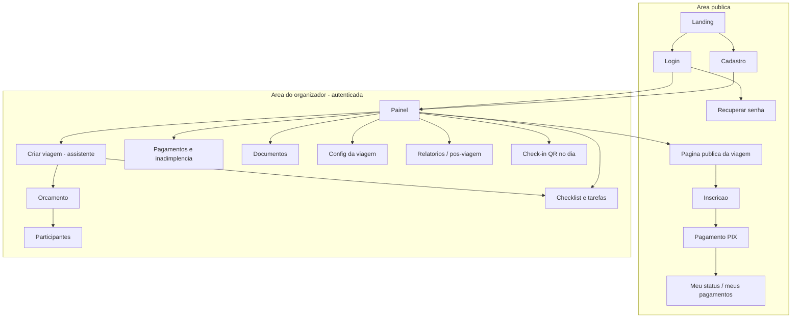
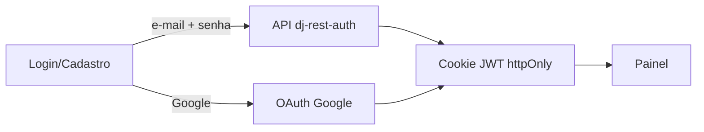
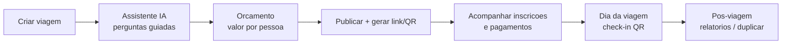
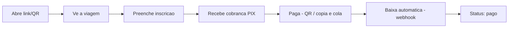

# 🗺️ Telas e Fluxos — NaviGo

Mapa das telas e dos fluxos do sistema, para os dois atores principais:
**organizador** (quem cria e gere a viagem) e **participante** (quem se inscreve
e paga). Marca a fase de cada tela (🟢 MVP · ⭐ Pro · 🏢 Business).

> Estado atual (Fase 0/1): já existem os esqueletos de **Login**, **Cadastro**,
> **Painel** e **Página pública da viagem** no PWA (`web/src/pages`).

---

## 1. Atores e áreas

- **Organizador** — área autenticada (painel): cria a viagem, define orçamento,
  acompanha inscrições e pagamentos, usa a IA e o checklist.
- **Participante** — área pública (por link/QR): vê a viagem, se inscreve e paga.
  Não precisa de conta no MVP.

---

## 2. Mapa de navegação

---

## 3. Fluxos principais

### 3.1 Autenticação

E-mails (verificação, recuperação de senha) saem pelo `EMAIL_BACKEND` — console
em dev, **Resend** em produção.

### 3.2 Organizador (do planejamento ao pós-viagem)

### 3.3 Participante (inscrição e pagamento)

---

## 4. Telas em detalhe

### 4.1 Autenticação
| Tela | Fase | Conteúdo |
|------|------|----------|
| **Login** | 🟢 | E-mail + senha, "Entrar com Google", link p/ cadastro e recuperação |
| **Cadastro** | 🟢 | E-mail + senha (username gerado); já autentica ao concluir |
| **Recuperar senha** | 🟢 | Pede e-mail → envia link (endpoint pronto) |
| **Perfil** | 🟡 | Nome, telefone, foto, **chave PIX** do organizador |

### 4.2 Organizador
| Tela | Fase | Conteúdo |
|------|------|----------|
| **Painel** | 🟢 | Viagens, vagas, arrecadado vs. meta, inadimplentes, tarefas |
| **Criar viagem (assistente)** | 🟢 | Wizard: dados básicos → perguntas da IA → estrutura montada |
| **Orçamento** | 🟢 | Itens por categoria; **valor por participante** em tempo real |
| **Participantes** | 🟢 | Lista + status (inscrito/confirmado/cancelado), detalhe, cadastro manual |
| **Pagamentos** | 🟢 | Parcelas, quem pagou/deve, lembretes, conciliação |
| **Checklist & tarefas** | 🟢 | Tarefas (geradas pela IA ou manuais), marcar concluídas |
| **Documentos** | 🟡 | Arquivos da viagem (contratos, listas) |
| **Config da viagem** | 🟢 | Editar dados, limite de vagas, publicar/encerrar |
| **Relatórios / pós-viagem** | ⭐ | Financeiro, participantes, avaliações; **duplicar viagem** |
| **Check-in (dia da viagem)** | ⭐ | Leitura de **QR** por câmera + lista digital |

### 4.3 Participante (público)
| Tela | Fase | Conteúdo |
|------|------|----------|
| **Página da viagem** | 🟢 | Destino, datas, valor, o que inclui, botão de inscrição |
| **Inscrição** | 🟢 | Dados do participante + aceite dos termos |
| **Pagamento PIX** | 🟢 | QR Code + copia e cola; status atualiza após a baixa |
| **Meu status** | 🟢 | Situação da inscrição e das parcelas |

### 4.4 Organização (Business)
| Tela | Fase | Conteúdo |
|------|------|----------|
| **Equipe & permissões** | 🏢 | Vários administradores, papéis (admin/financeiro/…) |
| **Relatórios da organização** | 🏢 | Consolidado de várias viagens, exportação |

---

## 5. Mapa telas → rotas (PWA)

| Rota | Tela | Existe? |
|------|------|---------|
| `/login` | Login | ✅ esqueleto |
| `/register` | Cadastro | ✅ esqueleto |
| `/` | Painel | ✅ esqueleto |
| `/trip/:slug` | Página pública da viagem | ✅ esqueleto |
| `/trips/new` | Criar viagem (assistente) | ⬜ Fase 1 |
| `/trips/:id/budget` | Orçamento | ⬜ Fase 1 |
| `/trips/:id/participants` | Participantes | ⬜ Fase 1 |
| `/trips/:id/payments` | Pagamentos | ⬜ Fase 1 |
| `/trips/:id/tasks` | Checklist & tarefas | ⬜ Fase 1 |
| `/trip/:slug/subscribe` | Inscrição | ⬜ Fase 1 |
| `/trip/:slug/pay` | Pagamento PIX | ⬜ Fase 1 |

> As rotas de `/trips/:id/*` são a área autenticada do organizador; `/trip/:slug`
> (singular) é a área pública do participante.
